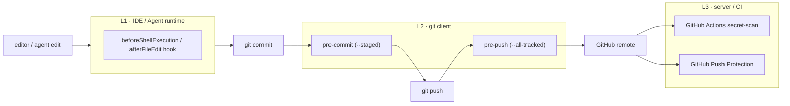

# RivalLens 凭据与机密防御设计

> 本文定义 RivalLens 仓库内 API key、provider token、数据库口令、私有 endpoint 等机密的端到端防御契约，约束研发、提交、CI、onboarding 全链路。
>
> **设计立场**：机密一旦进入 git 远端对象库即视同已泄露，任何"修复"都只是降级；防御的唯一胜利条件是机密**永不进入对象库**。所有约束围绕这一条展开。

## 1. 防御拓扑



三层独立部署。任意单层都不构成完整防御；任意单层故障也不应让机密通过。

## 2. 三层拦截职责矩阵

| 层 | 触发面 | 适用范围 | 失败策略 | 角色 |
|---|---|---|---|---|
| **L1** IDE/Agent hook | AI 工具的 shell / file-edit 调用 | 仅装该工具的本机用户 | 读类 fail-open；写类与 git 类 fail-closed | 辅助提醒，不是锁 |
| **L2** git 客户端 hook | `git commit` / `git push` | 装了 hook 的本地仓库 | `failClosed=true`，scanner 任何异常一律 deny | 团队级硬约束 |
| **L3** server / CI | `receive-pack` 与 push event | 远端所有协作者、所有分支 | fail-closed | 最终兜底 |

设计依据：

- **L1 不能独占防御**：协作者工具栈异质（不同 IDE、纯 CLI），单一工具 hook 不能约束整个团队。
- **L2 才是必经环节**：`本地编辑 → git commit → git push → 远端对象库`这条路径上，git client 是唯一所有协作者共享的硬节点。
- **L3 必须独立于 L2**：L2 可能因为本地未安装、被 `--no-verify` 跳过、或 hook 框架未初始化而失效；L3 在服务端兜底，对 L2 是否生效完全无依赖。

## 3. 模板文件信任规则

`.env.example` / `*.sample` / `*.template` 因必须入库而无法靠 `.gitignore` 防御，统一按"潜在写入面"对待。

```text
if file matches r"\.env\.(example|sample|template)$":
    每个赋值行的 value 必须满足之一：
        ^__REPLACE__[A-Z0-9_]+__$        # 团队约定的结构化占位符
        |placeholder hint set            # replace / your- / sample / changeme / xxx ...
        | 空字符串
    否则 → block
```

实施位置：`scripts/scan_secrets.py` `_is_placeholder_value()` 与 `STRUCTURED_PLACEHOLDER_PATTERN`。

**禁止反模式**：

- 字段名留空 + 注释引导"真值见内部文档/见飞书/见 wiki"
- 模板里出现真实 endpoint id / token 形式的"示意值"
- 在被 git 追踪的注释里写"账号信息见 X"

真值获取流程只能写在 gitignore 路径（`docs/private/`）。

## 4. scan_secrets 识别能力

`scripts/scan_secrets.py` 同时维护 `--staged`（diff 增量）与 `--all-tracked`（全量审计）两种模式，命中下列任一形态即 fail：

| 形态 | 示例 | 命中名 |
|---|---|---|
| 主流 issuer 裸 token | `sk-...` / `ghp_...` / `AKIA...` / `AIza...` / `xox[baprs]-...` | Cloud/API key literal |
| Volcano Engine ARK key | `ark-<UUID>-<suffix>` | Volcano Engine ARK key literal |
| Doubao endpoint id | `ep-[0-9]{10,}-[a-z0-9]{4,}` | Doubao endpoint id literal |
| Bearer token literal | `Bearer <16+ chars>` | Bearer token literal |
| **指令复制式赋值** | `KEY1=KEY2=<value>`（双等号特征） | Double-assignment paste (instruction-copy) |
| 敏感字段非占位符值 | `DOUBAO_API_KEY=<non-placeholder>` 等 | `<NAME> has non-placeholder value` |

"指令复制式赋值"针对 AI 协作时代的新失误模式：把含 `KEY=VALUE` 行的指令片段整段粘贴进模板文件，产生双等号特征。该形态无法由手敲产生，命中即视为机密泄露。

扫描器自身的 fail policy：扫描进程异常退出、超时、git 命令失败一律视为 deny，不允许"扫描器坏了所以放过"。

## 5. Onboarding 强制安装

`Makefile` 提供 `make setup`，是新协作者第一次 checkout 后的强制入口：

```bash
make setup
# → pre-commit install --hook-type pre-commit --hook-type pre-push
```

`.pre-commit-config.yaml` 注册两条 hook：

| Hook | Stage | 命令 | 作用 |
|---|---|---|---|
| `scan-secrets-staged` | `pre-commit` | `scan_secrets.py --staged --quiet` | 拦截当前 staging 区的新增明文 |
| `scan-secrets-tracked` | `pre-push` | `scan_secrets.py --all-tracked --quiet` | 拦截整树扫描，覆盖被 `--no-verify` 跳过 commit 的场景 |

不允许通过"裸 `core.hooksPath` + 文档说明"代替 `pre-commit install`：脱壳的安装步骤会在 onboarding 阶段被遗漏。

## 6. 远端兜底（L3）

| 通道 | 配置 | 触发面 |
|---|---|---|
| GitHub Actions `Secret Scan` | `.github/workflows/secret-scan.yml`，触发分支 `**`（不限默认分支） | 所有 push、所有 PR |
| GitHub Push Protection | 仓库设置启用，含自定义 issuer 模式（`ark-*` / `ep-*`） | 所有分支的 push |

设计要点：**任何分支** push 即视同机密进入对象库，不区分"PR 是否合并"。仅保护默认分支的合并规则不构成 L3。

## 7. 误操作应急 SOP

机密疑似进入对象库时（来自 issuer 告警邮件、Push Protection 阻断、内部审计），按以下顺序处置，不允许跳步：

1. **先 rotate，再清理**——立即通知 issuer 失效该 token；history rewrite 不能保证未被外部抓取。
2. 关闭涉及的 PR、删除源分支；本地 `git reflog expire --expire=now --all && git gc --prune=now`。
3. 仓库若仍 public，立即转 private 以降低传播面。
4. 若需服务端清除 PR ref / commit cache，提交 GitHub Support 工单（PR ref 无法自助删除）。
5. 复核：`make scan-secrets` + 同 issuer 前缀的 `git log -S` 全历史扫描，确认无副本。
6. **修复 commit 仅改占位符**不计入"已修复"——结案条件是 `token 已失效 + 全量扫描无副本`。

## 8. 自检清单

提交结构性变更或新成员入职前，逐条核验：

- [ ] `git config --get core.hooksPath` 与 `.git/hooks/pre-commit` / `pre-push` 实际存在且可执行
- [ ] 把所有协作者切换到任意其他 IDE/Agent，机密拦截链路是否仍然成立
- [ ] `.env.example` 每个敏感字段值是否能被一条 grep 覆盖（`__REPLACE__` 或 placeholder hint）
- [ ] `scripts/scan_secrets.py` 能否识别"双等号指令复制"
- [ ] GitHub Push Protection 是否对**所有分支**启用，含本仓库使用的 issuer 自定义模式
- [ ] 仓库内是否存在"安全约束仅写在 IDE rules / SKILL.md 里"的孤立约束（无对应机器拦截）
- [ ] 上一次"机密误入"事件的修复是否包含 token rotate

## 9. 文档与代码联动

| 关注点 | 入口 |
|---|---|
| 系统总边界 | `docs/2-architecture-decision.md` |
| 信息采集合规 | `docs/6-compliance-statement.md` |
| Env / secret 工程规则 | `.cursor/rules/env-secrets.mdc` |
| 机密扫描器 | `scripts/scan_secrets.py` |
| L1 IDE hook | `.cursor/hooks/safety_guard.py` + `.cursor/hooks.json` |
| L2 git hook | `.pre-commit-config.yaml` + `Makefile` `setup` 目标 |
| L3 CI | `.github/workflows/secret-scan.yml` |
| 真值获取流程 | `docs/private/team-onboarding.md`（gitignore，不入库） |
