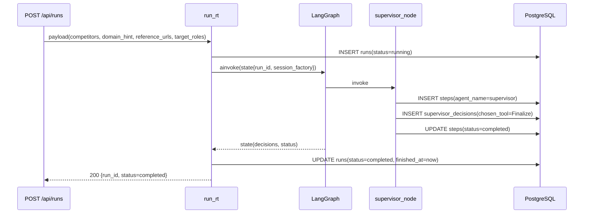
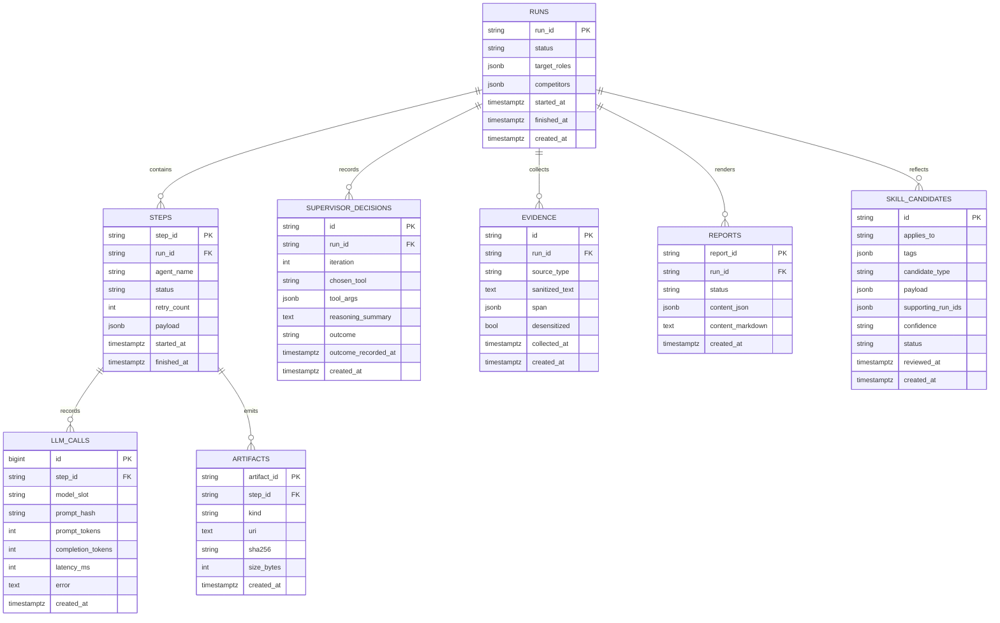

# RivalLens 实现细节：持久化层与第一条可观测数据流

## 1. 文档定位

- `docs/0-5`：稳定的顶层约束（架构边界、Agent 边界、协议契约、团队协作）。
- `docs/impl/*`：按每一刀代码落地沉淀的实现细节（可随实现演进快速更新）。
- 本文只记录 `db-persistence-layer` 这一刀的工程实现，不重复顶层原则论证。

交叉引用：

- 架构边界：`docs/2-architecture-decision.md`（§3.4 / §3.5 / §7）
- Agent 边界：`docs/2.5-agent-architecture.md`
- Schema 与协议：`docs/3-schema-and-protocol.md`（§5.2 / §8）

## 2. 数据流时序（`/api/runs`）

## 3. 表关系（8 张业务表）

## 4. 事务边界与不变量

### 4.1 为什么传 `session_factory`，不传 `AsyncSession`

- `LangGraph state` 需要可在节点边界安全传递；长生命周期 `AsyncSession` 容易跨节点泄漏事务上下文。
- 传 `session_factory` 可以让每个节点自行打开短事务：边界清晰、失败回滚范围小。
- 该策略与 `docs/2` 的 fail-fast 原则一致：`session_factory` 缺失直接抛错，不静默降级。

### 4.2 为什么节点内开短事务

- `supervisor_node` 的本刀职责是写入最小可观测轨迹（`steps` + `supervisor_decisions`）。
- 节点内单次事务提交，保证这两类记录在同一决策单元内原子可见。
- 避免把事务控制扩散到 router / graph 编排层，减少隐式耦合。

### 4.3 append-only 约束

- append-only 表：`evidence` / `llm_calls` / `artifacts` / `supervisor_decisions`
- 工程约束：这些表只允许 `INSERT`，不做业务语义 `UPDATE`，用于回放与审计。
- 可变状态集中在 `runs` / `steps` / `reports` / `skill_candidates.status`，与顶层文档一致。

## 5. 当前刀的验收口径

- Alembic 初始迁移可创建 8 张业务表。
- `POST /api/runs` 后，数据库至少出现：
  - 1 行 `runs`
  - 1 行 `steps`
  - 1 行 `supervisor_decisions`
- `supervisor_decisions.chosen_tool` 为 `Finalize`，用于证明最小决策链路已经持久化。
