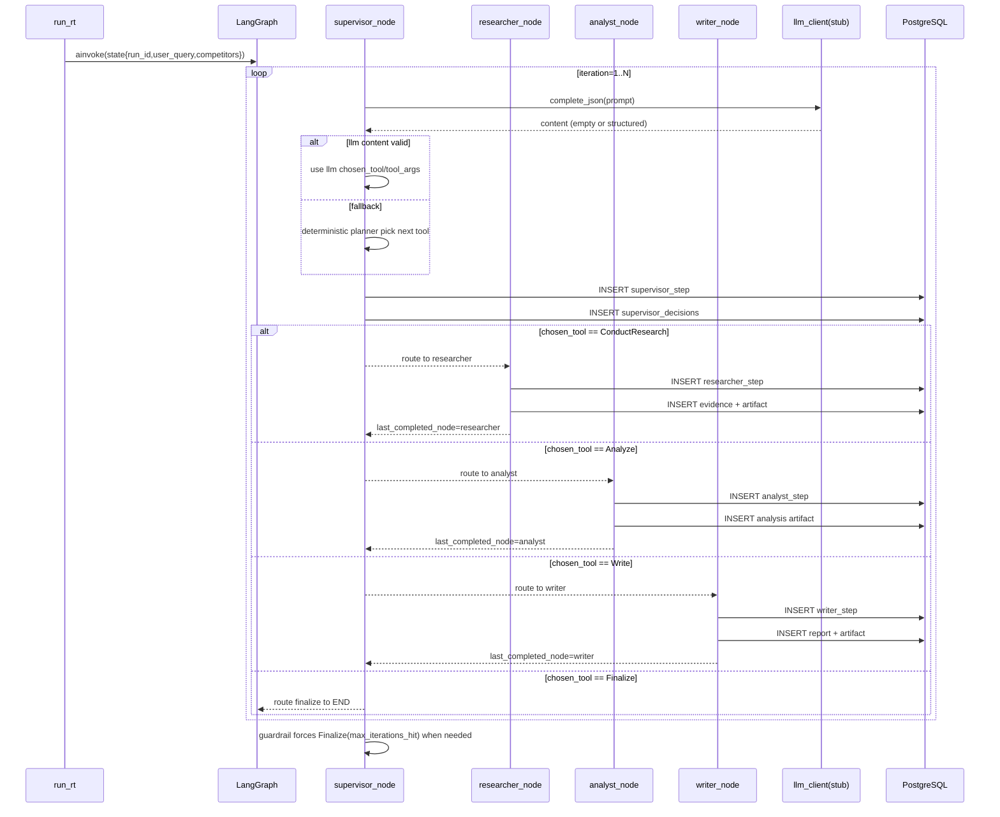

# RivalLens 实现细节：Supervisor 多轮委派循环

## 1. 目标边界

本刀在 `01-persistence-flow` 基础上，把 Supervisor 从“单次 Finalize 桩”升级为“多轮委派循环”。

落地目标：

- 同一 run 内产生多条 `supervisor_decisions` 与 `steps`
- 决策链路至少覆盖 `DiscoverCompetitors（可选）-> ConductResearch -> Analyze -> Write -> Finalize`
- 保留 LLM 调用入口（当前为 stub），并提供强约束 fallback 规划器
- 触发最大迭代护栏时强制 `Finalize(max_iterations_hit)`

## 2. 决策循环时序（含真实子节点）

## 3. 规划策略（fallback planner）

- `pending competitors` 不为空：`ConductResearch`
- 所有竞品已覆盖且未分析：`Analyze`
- 已分析且未写作：`Write`
- 前三阶段完成：`Finalize(all_dimensions_covered)`

该策略保证在没有真实模型输出时仍能生成稳定、可测试、可审计的决策路径。

## 4. 事务与可观测性约束

- Supervisor 每轮迭代写入 `supervisor step + supervisor_decision`
- Researcher / Analyst / Writer 分别在各自节点内写入各自 `step` 与对应产物
- `step.payload` 记录：
  - `iteration`
  - `chosen_tool`
  - `tool_args`
  - `llm_provider`
  - `llm_prompt_preview`
- run 最终状态由 graph 返回值驱动：`completed | degraded`

## 5. API 侧同步

`POST /api/runs` 新增可选字段：

- `user_query`（默认 `"skeleton"`）

并将该字段写入 `runs.user_query`，同时注入 graph state 参与决策 prompt。

## 6. 验证口径

- `test_create_run_persists_rows`：`steps` 至少 4 行，最新决策为 `Finalize`
- `test_get_run_detail_and_trace`：
  - `GET /api/runs/{run_id}` 返回原始 `user_query`
  - `GET /api/runs/{run_id}/trace` 决策链包含 `ConductResearch`、`Analyze`、`Write`、`Finalize`（赛道扫描场景额外包含 `DiscoverCompetitors` 与 `agent_name=discovery` 步骤）
  - `GET /api/runs/{run_id}/trace` 的 `steps.agent_name` 至少包含 `researcher`、`analyst`、`writer`（discovery 场景另含 `discovery`）

## 7. 后续演进位

- 用真实 tool-calling 输出替换 fallback planner 的主要路径
- 引入 QA rejection 对 `triggered_by` 的反馈闭环
- 将 `llm_calls` 与 supervisor 循环打通，形成完整 token/latency 追踪
