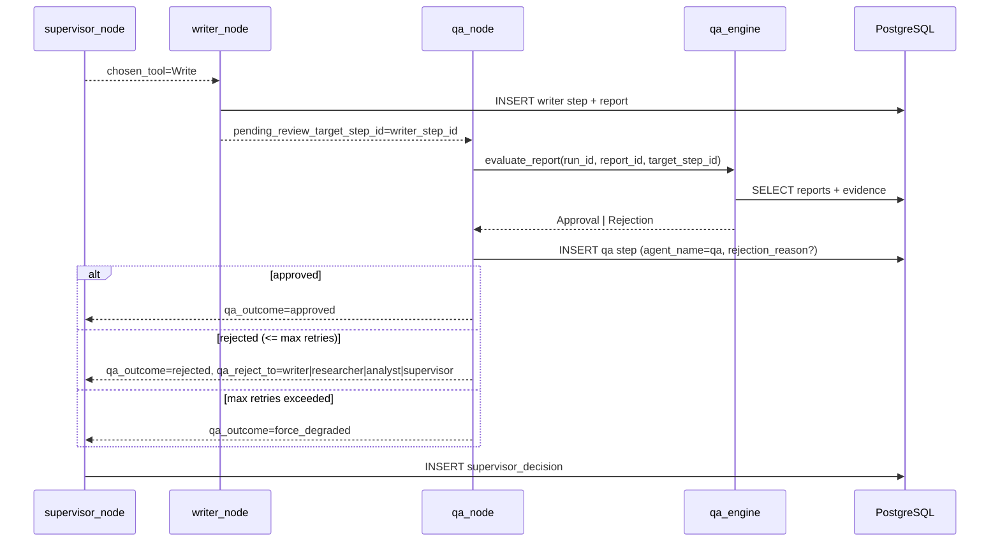
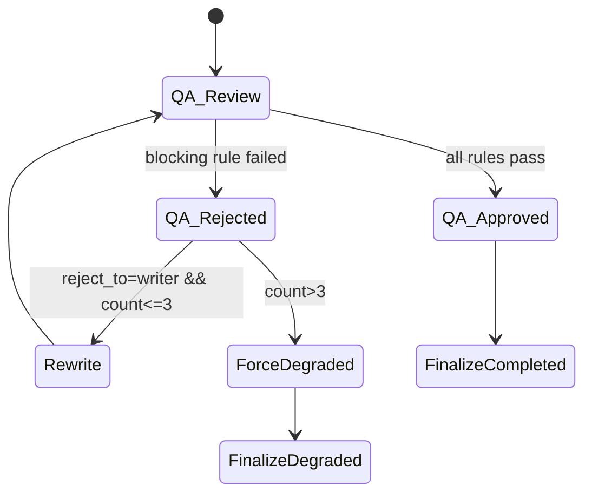

# RivalLens 实现细节：QA Reviewer fast-path（writer -> qa）

## 1. 本刀目标

在现有 `researcher -> analyst -> writer` 流程后，插入 `qa` 节点形成最小质量闭环：

- `writer -> qa -> supervisor` 替换原 `writer -> supervisor`
- QA 先走结构化 fast-path 规则（不依赖真实 LLM）
- QA rejection 支持多目标路由字段（`writer/researcher/analyst/supervisor`）
- 第一版只真实化 `reject_to=writer`；其余目标暂降级 `Finalize(degraded)`

交叉引用：

- `docs/2-architecture-decision.md` §10.3（幻觉抑制）
- `docs/2.5-agent-architecture.md` §3.5 / §5（QA 多目标协议）
- `docs/3-schema-and-protocol.md`（`Rejection` / `Approval` 协议）

## 2. 主图变化时序

## 3. Fast-path 规则定义

| 规则 ID | 说明 | 失败路由 |
| --- | --- | --- |
| `rule_report_must_have_markdown_content` | `content_markdown.strip()` 非空 | `writer` |
| `rule_report_template_id_valid` | `content_json.template_id` 在允许集合（默认 `battlecard_default`） | `writer` |
| `rule_report_must_have_at_least_one_section` | `content_json.sections` 至少 1 项 | `writer` |
| `rule_evidence_must_be_desensitized` | 本 run 的 `evidence.desensitized` 必须全为 `true` | `researcher` |

规则全部是 `blocking`，任一失败即 `Rejection`。

## 4. 多目标 rejection 路由矩阵（第一版）

| QA 输出 | Supervisor 行为 | Run 状态 |
| --- | --- | --- |
| `approved` | 继续既有规划器，通常进入 `Finalize` | `completed` |
| `rejected` + `reject_to=writer` | 强制下发一次 `Write` 重写决策 | `running` |
| `rejected` + `reject_to in {researcher, analyst, supervisor}` | 暂不回派上游，直接 `Finalize(fallback_path)` | `degraded` |
| `force_degraded` | 直接 `Finalize(fallback_path)`（原因：`qa_max_retries_hit`） | `degraded` |

说明：上游回派未在本刀真实化，避免在桩节点阶段引入死循环。

## 5. `max_qa_rejections` 状态机

## 6. 数据库迁移对应关系

新增迁移：`backend/app/alembic/versions/0002_add_rejection_reason_to_steps.py`

- `steps.rejection_reason JSONB NULL`
- GIN 索引：`ix_steps_rejection_reason_gin`

用途：

- 记录 QA rejection 的完整结构化结果（`reject_to`、`failed_rule_ids`、`retry_policy`）
- 支撑后续按规则/路由目标做回放与检索

## 7. 已知暂行决策与摘除时机

暂行决策：

- `reject_to=researcher/analyst/supervisor` 先降级 `Finalize(degraded)`，不立即回派

摘除时机：

- 当 Researcher/Analyst 进入“真实工具 + 真实产物”阶段后，开启对应回派路径
- 同时补充防循环策略（上限迭代 + 去重条件 + 规则粒度重试）
