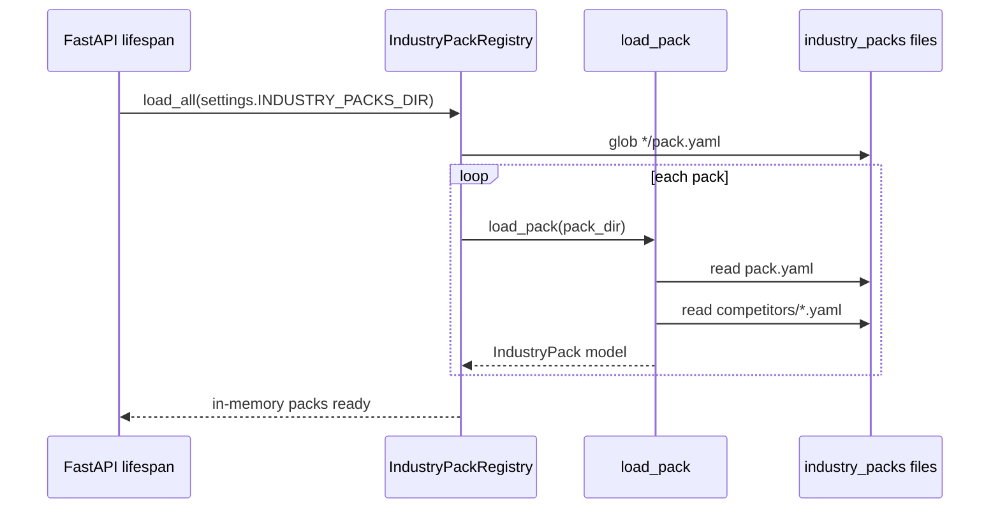

# RivalLens 实现细节：Industry Pack 装载与 Researcher 真实证据

## 1. 文档定位

- `docs/2` / `docs/2.5` / `docs/3`：稳定架构与协议约束
- `docs/impl/*`：按迭代记录可执行实现细节
- 本文只记录 `industry-pack-researcher` 这一刀的落地代码与验证口径

## 2. 目录结构

```text
industry_packs/
  ai_coding_tools/
    pack.yaml
    competitors/
      cursor.yaml
      windsurf.yaml
backend/app/service/industry_pack/
  __init__.py
  models.py
  loader.py
  registry.py
```

## 3. YAML schema 锁定

`pack.yaml`：

- `id`
- `name`
- `version`
- `default_focus_dimensions`（受 `FocusDimension` 限制）
- `description`
- `competitor_files`

`competitors/*.yaml`：

- `id`
- `display_name`
- `aliases`
- `official_url`
- `category`
- `snapshots`（key 必须是 `feature/pricing/user_feedback/positioning/tech_stack` 之一）
  - 每个维度下为 `DimensionSnippet[]`
  - 字段：`quote`, `source_url`, `source_title`, `desensitized`

## 4. 启动装载时序



失败策略：目录不存在、文件缺失、维度非法都会在启动时直接抛错，服务不启动（fail-fast）。

## 5. Researcher 数据流前后对比

### Before

- Researcher 固定写 1 条占位 evidence
- `source_type=offline_snapshot`
- `source_url=None`
- `sanitized_text` 为模板字符串

### After

- Researcher 从 `state.industry_pack` 读取 pack
- 按 `request.competitor_id` + `focus_dimensions` 拉取 snapshot
- 对每个维度的每条 snippet 落一条 `EvidenceRecord`
  - `source_type=industry_pack_snapshot`
  - `source_url/source_title` 为真实离线快照来源
  - `span` 包含 `dimension/competitor_id/pack_id`
  - `sanitized_text=quote`

## 6. 与 QA 规则的接口约束

QA fast-path 中 `rule_evidence_must_be_desensitized` 会遍历 run 内 evidence。当前约束：

- pack snippet 必须显式带 `desensitized`
- 值为 `false` 时，QA 会走 rejection（`reject_to=researcher`）

这保证了「行业包输入」与「QA 审查」的契约可追踪、可验证。

## 7. 扩展新行业包步骤

1. 在 `industry_packs/<new_pack>/` 新增 `pack.yaml`
2. 新建 `competitors/*.yaml` 并在 `competitor_files` 注册
3. 保证维度 key 命中 `FocusDimension` 白名单
4. 重启服务，检查 startup 日志和 `registry.list_ids()`
5. 通过 `/api/runs` 传入新 `industry_pack` 与合法 `competitors`
