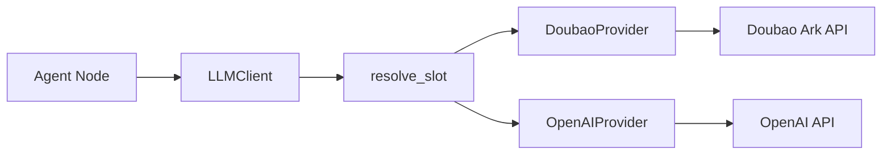

# 05 - LLM Provider 抽象层落地

## 目标

这一刀只落地 LLM 基础设施层，不改 Supervisor/Researcher 调度逻辑：

- 双 provider（Doubao + OpenAI）统一接入；
- 五槽位（`summarization/research/compression/qa/writer`）独立路由；
- 单一 `LLMClient.complete_json` 编排重试、限流、JSON 解析；
- 为后续 Supervisor/Researcher 真化提供稳定契约。

## 设计图

## 核心文件

- `backend/app/service/llm/providers.py`
  - `LLMProvider` 协议
  - `DoubaoProvider` / `OpenAIProvider`
  - `build_providers()` 按槽位配置 lazy 初始化
- `backend/app/service/llm/routing.py`
  - `resolve_slot(slot, providers)` 返回 `(provider, model)`
- `backend/app/service/llm/client.py`
  - `LLMClient.complete_json(...)`
  - 内置 `Semaphore`、重试退避、`prompt_hash`、格式错误处理
- `backend/app/service/llm/response.py`
  - `ProviderRawResponse`
  - `LLMResponse`
- `backend/app/service/llm/prompts.py`
  - `SUPERVISOR_SYSTEM_PROMPT`
  - `build_supervisor_user_prompt(...)`

## 配置矩阵

### Provider 级

- `DOUBAO_BASE_URL`
- `DOUBAO_EP`
- `DOUBAO_API_KEY`
- `OPENAI_BASE_URL`
- `OPENAI_DEFAULT_MODEL`
- `OPENAI_API_KEY`

### 槽位级

- `LLM_PROVIDER_SUMMARIZATION`
- `LLM_PROVIDER_RESEARCH`
- `LLM_PROVIDER_COMPRESSION`
- `LLM_PROVIDER_QA`
- `LLM_PROVIDER_WRITER`
- `LLM_MODEL_<SLOT>`（可选覆盖）

## LLMResponse 字段

- `model_slot`：本次调用的逻辑槽位
- `provider`：`doubao/openai/legacy_stub`
- `model_name`：实际命中的模型
- `prompt_preview`：截断后的 prompt 预览
- `prompt_hash`：`sha256(system + user)[:64]`
- `content`：解析后的 JSON object
- `prompt_tokens/completion_tokens/latency_ms`：观测字段
- `error`：失败原因（为空表示成功）

## 与 docs/2 的对应

- `docs/2 §3.8`：配置式多模型路由（五槽位）已落地；
- `docs/2 §10.1`：LLM 重试与错误字段可观测已在 client 层具备；
- `docs/2 §3.10`：`LLMResponse` 已具备写入 `llm_calls` 所需字段（下一刀接入 supervisor/researcher 持久化）。
