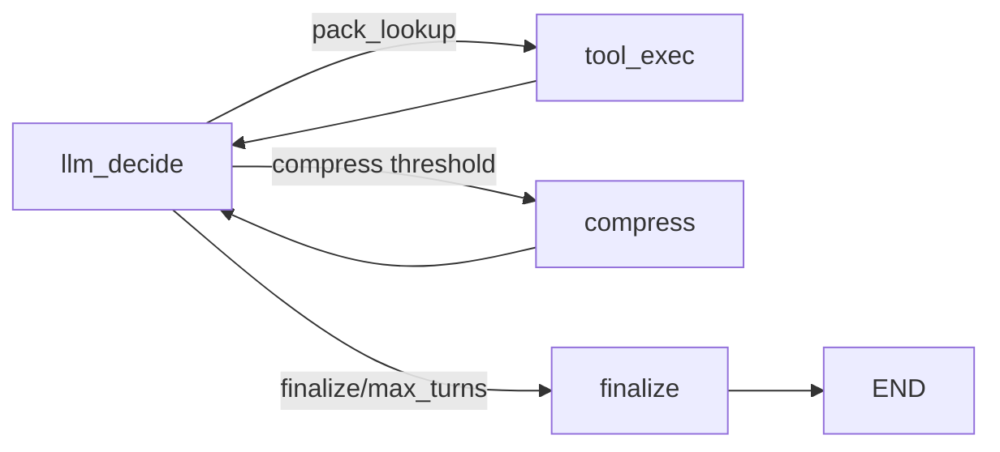

# 06 - Researcher ReAct Subgraph + Compression

## 目标

把 Researcher 从“直接读 industry pack 的确定性节点”升级为可追踪的 ReAct 子图：

- 每个 turn 由 LLM 决策 `pack_lookup` 或 `finalize`；
- 工具 observation 才能转成 evidence（禁止幻觉注入）；
- 长上下文超过阈值时进入 compression 槽位做压缩；
- 每个 turn/compression 都记录到 `llm_calls`，挂在 researcher step 下。

## 状态机

## 节点职责

- `llm_decide`
  - 调 `LLMClient.complete_json(model_slot=\"research\")`
  - 解析 `action/action_args`
  - 非法输出走 fallback：优先补齐 `pending_dimensions`，否则 finalize
- `tool_exec`
  - 执行 `pack_lookup(industry_pack_id, competitor_id, dimension)`
  - 仅从 observation.snippets 累积 `evidence_drafts`
  - 更新 `pending_dimensions/queried_dimensions`
- `compress`
  - 调 `LLMClient.complete_json(model_slot=\"compression\")`
  - 生成 `compressed_summary` 并替换消息窗口
- `finalize`
  - 输出最终汇总，不写库

## 触发阈值

- `MAX_REACT_TURNS = 6`
- `COMPRESS_AFTER_TURNS = 4`
- `COMPRESS_AFTER_CHARS = 2400`

## Researcher 持久化策略

在 `researcher_node` 中执行子图后统一落库：

- `steps`：1 行（agent=`researcher`）
- `evidence`：从 `evidence_drafts` 批量写入
- `llm_calls`：子图里的每次 `research/compression` 调用都写一行（同 `step_id`）
- `artifacts`：1 行 `research_fragment`

## 幻觉抑制不变量

- `evidence` 只能来自 `pack_lookup` 的 `snippets`；
- LLM 不能直接写 evidence；
- 若 `evidence_drafts` 为空，researcher 直接抛错终止（fail-fast）。

## 与 docs/2 对齐

- `§3.1` Researcher ReAct subgraph：已落地
- `§10.3` 长上下文 compression：已落地
- `§3.8` 五槽位中的 `research/compression` 已被真实消费
