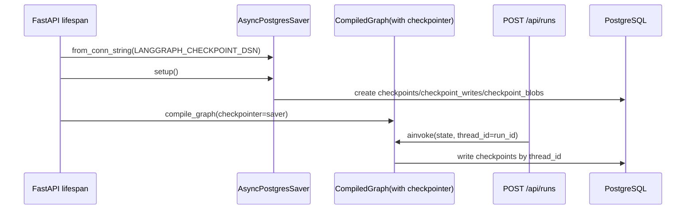

# 07 - LangGraph Checkpoint Postgres 接入

## 目标

把 checkpoint 从“设计项”变成运行时事实：

- 启动阶段自动初始化 checkpoint 表；
- `thread_id=run_id` 的 run 级隔离；
- 执行图通过 `checkpointer` 编译，不再使用无状态全局 `get_graph()`；
- `run_rt` 调用时显式传入 `configurable.thread_id`。

## 接入位置

- `backend/app/requirements.txt`
  - `langgraph-checkpoint-postgres==2.0.13`
  - 补 `psycopg[binary]` 与 `psycopg-pool`，避免容器内缺 `libpq` 导致 `ImportError`
- `backend/app/core/config.py`
  - 新增 `LANGGRAPH_CHECKPOINT_DSN`
  - 缺省从 `DATABASE_URL_SYNC` 派生并规范为 `postgresql://` 格式
- `backend/app/agents/graph.py`
  - 拆为 `build_graph_uncompiled()` + `compile_graph(checkpointer=...)`
- `backend/app/app_main.py`
  - lifespan 中创建 `AsyncPostgresSaver.from_conn_string(...)`
  - 启动时执行 `setup()`
  - 编译后图挂到 `app.state.compiled_graph`
- `backend/app/router/run_rt.py`
  - 从 `request.app.state.compiled_graph` 获取图
  - `ainvoke(..., config={\"configurable\": {\"thread_id\": run_id}})`

## 运行时数据流

## 边界约束

- `checkpoints/checkpoint_writes/checkpoint_blobs` 由 LangGraph 自管理；
- 业务表（`runs/steps/llm_calls/evidence/...`）仍由 Alembic 管；
- 二者共享同一 Postgres 实例，但职责边界清晰，不互相覆写。

## 验证

- smoke 断言：
  - `checkpoints` 存在 `thread_id=run_id` 行；
  - `checkpoint_writes` 存在 `thread_id=run_id` 行。
- 这证明 checkpoint 已从“配置存在”变成“实际写入”。

## 与 docs/2 对齐

- `§3.9` LangGraph Checkpoint：已落地
- `§3.4` PostgreSQL 作为 checkpoint backend：已落地
- `§8.2` 多 run 隔离：通过 `thread_id=run_id` 实现基础隔离能力
