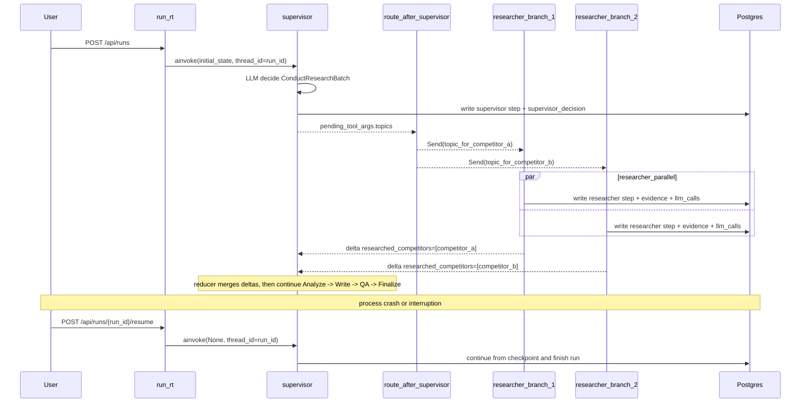
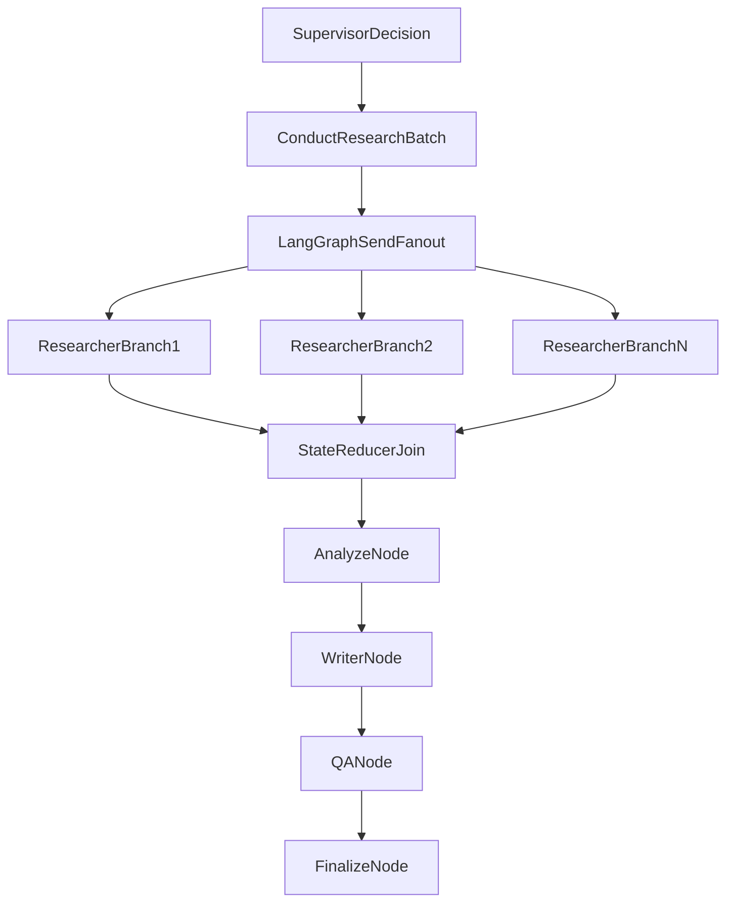

# 实现切片 09：Send fan-out 与 Resume 端点

## 1. 目标与边界

本切片落地 `docs/2-architecture-decision.md` 的两个缺口：

- Supervisor 可在单次决策中并行派发多个 Researcher 分支（LangGraph `Send` fan-out）；
- 通过 `POST /api/runs/{run_id}/resume` 从 checkpoint 恢复运行。

本切片明确不做：

- 不做真实 collector（`fetch_url` / `search`）；
- 不做 `reset_to` 指定阶段重放（B2）；
- 不引入新数据库迁移。

## 2. 关键设计决策

### 2.1 ConductResearchBatch 工具

- 在 `backend/app/schemas/supervisor.py` 新增 `ConductResearchBatch`：
  - `topics: list[ConductResearch]`（1..8）
  - `parallelism_rationale: str`
- `SupervisorDecision.chosen_tool` 扩展为：
  - `ConductResearch` / `ConductResearchBatch` / `Analyze` / `Write` / `Finalize`

这样可以保持工具语义单一：`ConductResearch` 表示单目标研究，`ConductResearchBatch` 表示多目标并行研究。

### 2.2 AgentState reducer

- `backend/app/agents/state.py` 对并发更新字段加 reducer：
  - `researched_competitors`: `operator.add`（累加分支增量）
  - `pending_tool_args` / `last_completed_node` / `status`: last-write-wins
- `researcher_node` 改为返回增量（delta-only），避免把完整历史列表重复拼接。

### 2.3 Send 路由

- `backend/app/agents/graph.py` 中 `_route_after_supervisor`：
  - 当 `pending_tool_args.topics` 为多项时，返回 `list[Send]`；
  - 每个 `Send` 分支注入最小执行上下文：`run_id`、`domain_hint`、`reference_urls`、单个 topic 的 `pending_tool_args`；
  - 非 batch 情况仍按原路径返回 `researcher` / `analyst` / `writer` / `finalize`。

### 2.4 Resume 范式（B1）

- `backend/app/router/run_rt.py` 新增 `POST /api/runs/{run_id}/resume`；
- 仅允许 `status == "running"` 的 run 恢复；否则返回 `409 RUN_NOT_RESUMABLE`；
- 通过 `graph.ainvoke(None, config={"configurable": {"thread_id": run_id}})` 从 checkpoint 续跑；
- 恢复完成后回写 `runs.status` 与 `runs.finished_at`。

## 3. 数据流 Sequence 图

## 4. Fan-out 拓扑 Flowchart 图

## 5. Trace 一致性约束

本切片遵循以下可观测等式：

- 一次 `ConductResearchBatch` 的 `supervisor_decision` 会展开为 `N` 条 `agent_name="researcher"` 的 `steps`；
- 每条 researcher step 仍独立拥有自己的 `evidence` 与 `llm_calls`；
- `researched_competitors` 最终值由 reducer 对 researcher 分支增量进行合并得到。

## 6. 已知边界

- 不支持 `reset_to` 精确阶段重放（仅支持 thread 级 checkpoint 续跑）；
- 不支持跨 `thread_id` 的状态复用；
- 当前并发协调为单实例进程内 fan-out；多 worker 场景若要共享并发控制，后续再评估引入外部协调层（例如 Redis）。
