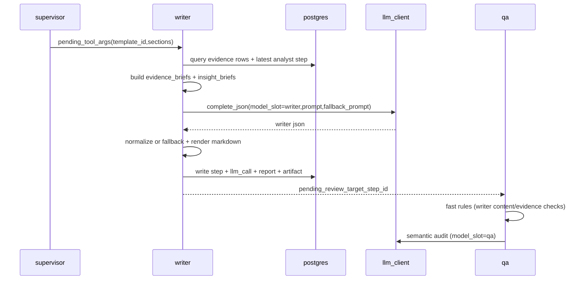
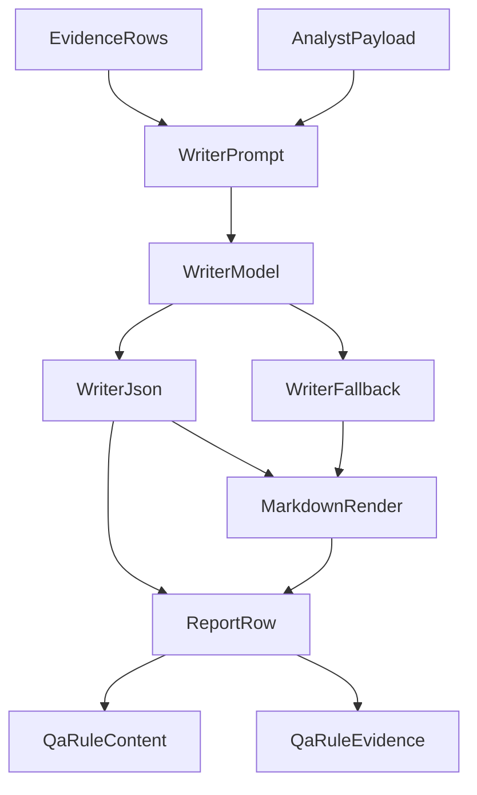

# 实现切片 10：Writer LLM 真化

## 1. 目标与边界

本切片把 Writer 从模板桩升级为可交付 battlecard 生成器，核心目标：

- Writer 必须消费 `evidence` 与 analyst 结果（`analysis_payload`）；
- Writer 调用 `model_slot="writer"` 并把 `llm_calls` 持久化；
- LLM 输出不合法时走 deterministic fallback，仍输出可评审报告；
- QA 快规则新增 writer 内容与 evidence 引用校验，阻止空壳报告通过。

本切片不做：

- 不接入真实 collector；
- 不做前端渲染；
- 不引入新表/新迁移（沿用 `reports.content_json` JSONB）。

## 2. 关键设计决策

### 2.1 Writer 输出契约

`reports.content_json` 统一为：

- `template_id`
- `title`
- `executive_summary`
- `sections[]`（含 `section_id/title/content_markdown/evidence_refs/insight_refs`）
- `risk_callouts[]`

`reports.content_markdown` 由 deterministic serializer 渲染，强制内联 evidence 引用格式 `[ev_xxx]`。

### 2.2 Analyst 到 Writer 的通道

Analyst 在 `steps.payload` 新增 `analysis_payload`，Writer 读取最近一条 completed analyst step：

- summary / insights / risk_flags / recommended_sections
- 用于 writer prompt 与 fallback 渲染

### 2.3 QA 规则收紧

新增两条 blocking 规则：

- `rule_writer_sections_must_have_content`
- `rule_writer_must_cite_evidence`

确保 Writer 不再退化成“有 template_id 但无实质内容”的伪报告。

## 3. 数据流 Sequence 图

## 4. Writer 报告流转图

## 5. Trace 一致性约束

每次 writer 执行满足如下约束：

- `steps` 中有一条 `agent_name="writer"`；
- `llm_calls` 中有一条 `model_slot="writer"` 且 `step_id` 对应 writer step；
- `reports` 中有一条最新 `content_json + content_markdown`；
- `content_markdown` 至少出现一个 `[ev_` 引用；
- QA 拒绝时会通过 `reject_to="writer"` 回流到 supervisor。

## 6. 已知边界

- 目前 Writer 只消费 run 内 evidence，不拉取外部 source；
- `insight_refs` 是逻辑引用（如 `insight_1`），不是独立表主键；
- 大规模 evidence 下 token 成本会升高，当前通过 brief 截断控制；
- 若 run 内无可用 evidence，Writer fallback 仍会输出报告，但 QA 大概率打回 researcher。
