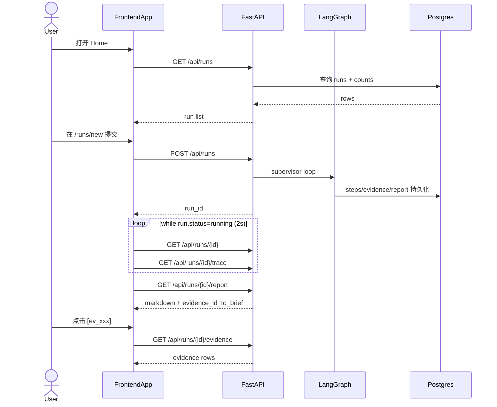

# 实现切片 11：前端骨架与前后端联调主干

## 1. 目标与边界

本切片目标是把前后端联调主干打通，确保团队成员可以并行开发：

- 前端从空目录升级为可运行的 Vite + React + TypeScript 工程；
- 后端补齐前端联调所需的 4 个 GET 接口；
- 跑通主流程：`新建 run -> 运行态观察 -> 报告渲染 -> evidence 抽屉 -> trace`；
- 保持前后端分离，前端本地 `npm run dev`，后端走 docker compose。

本切片不做：

- 单竞品详情页 / Voice / Compare / Skill Staging；
- SSE 实时事件流（当前用 polling）；
- React Flow DAG 视图（trace 页第一版用时间线）。

## 2. 前端目录骨架

```text
frontend/
  src/
    api/
      client.ts
      hooks.ts
      types.ts
    app/
      layout/AppShell.tsx
      router.tsx
    components/
      StatusBadge.tsx
      EvidenceDrawer.tsx
      ui/*
    pages/
      HomePage.tsx
      NewRunPage.tsx
      RunViewPage.tsx
      RunTracePage.tsx
      NotFoundPage.tsx
    lib/
      utils.ts
      format.ts
```

## 3. 新增后端接口契约

### 3.1 `GET /api/runs`

返回 run 列表分页：

- query: `status`, `limit`, `offset`
- response: `items[] + total + limit + offset`
- 每个 item 含 `step_count/evidence_count/has_report`，前端可直接渲染列表卡片

### 3.2 `GET /api/runs/{run_id}/report`

返回报告主体：

- `content_markdown`
- `content_json`
- `generated_at`
- `evidence_id_to_brief`（用于 citation 展开）

### 3.3 `GET /api/runs/{run_id}/evidence`

返回 evidence 列表：

- 支持 query: `competitor_id`, `source_type`
- 每条记录含 `sanitized_text/source_url/source_type/competitor_id/metadata`

### 3.4 `GET /api/industry-packs`

返回前端创建任务页所需的行业包目录：

- `id/display_name/description`
- `competitors[]`
- `research_dimensions[]`

## 4. 联调数据流



## 5. 为什么第一版用 polling

当前 `useRunDetail/useRunTrace` 在 `status=running` 时启用 `2s` 轮询：

- 优先目标是尽快跑通联调主干；
- 后端 SSE 还未落地（见 backlog M4）；
- 2 秒刷新已经能满足 run 级进度观察。

后续切换 SSE 时，前端页面可复用现有状态模型，仅替换数据订阅层。

## 6. 可扩展点（给 M2/M4 预留）

- `RunViewPage` 的 report 区域可直接扩展成单竞品详情/compare/voice 子路由；
- `EvidenceDrawer` 已抽成独立组件，可在 compare/voice 页面复用；
- `RunTracePage` 已拆分 tabs，后续可把 `LLM calls` 页替换为真实 llm_calls endpoint；
- `api/hooks.ts` 已统一封装，后续切 SSE 只改 hooks 不改 UI 结构。
